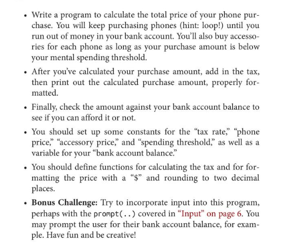

**PRACTICE 1**


**PROBLEM STATMENT**
⚫ Write a program to calculate the total price of your phone pur- chase. You will keep purchasing phones (hint: loop!) until you run out of money in your bank account. You'll also buy accesso- ries for each phone as long as your purchase amount is below your mental spending threshold.
⚫ After you've calculated your purchase amount, add in the tax, then print out the calculated purchase amount, properly for- matted.
. Finally, check the amount against your bank account balance to see if you can afford it or not.
. You should set up some constants for the "tax rate," "phone price," "accessory price," and "spending threshold," as well as a variable for your "bank account balance."
. You should define functions for calculating the tax and for for- matting the price with a "$" and rounding to two decimal places.
⚫ Bonus Challenge: Try to incorporate input into this program, perhaps with the prompt(..) covered in "Input" on page 6. You may prompt the user for their bank account balance, for exam- ple. Have fun and be creative!
__________________________________________________________________________________________________________________________________________________________

```
const PHONE_PRICE = 500;
const TAX = 0.05;
const BANK_BAL = 2000;
const ACCEESSORY_PRICE = 200;
const THRESHOLD = 500;

let items = 0;
let amt = 0;

function calculateTaxableAmt(amount){
  return amount*TAX;
}

function calculateTotalPurchase(){
  //we'll keep purchaseing the ph , untill we run out of money
  if(ACCEESSORY_PRICE > THRESHOLD ){
    return "you can't afford ph accessory...";
  }
  
  while(amt < BANK_BAL ){
  console.log("amt ###:", amt);
    amt += PHONE_PRICE + ACCEESSORY_PRICE
    items++;
    let tax = calculateTaxableAmt(PHONE_PRICE + ACCEESSORY_PRICE);
    let finalAmt = amt +
    
    if(finalAmt > BANK_BAL){
      finalAmt -= (PHONE_PRICE + ACCEESSORY_PRICE + tax); 
      items--;
      amt = finalAmt;
      break;
    }
    amt = finalAmt;
  }
  console.log("amt:", amt, "items:", items );
  return amt;
}

console.log("total:",calculateTotalPurchase());
```